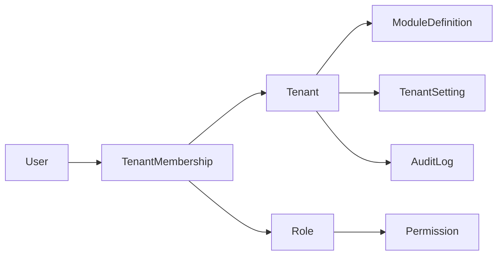

# DCA OS v1 - Database Gate Design

## 1. Executive Summary

This document defines the intended database foundation for DCA OS v1.

It approves design direction only:

- no migrations are approved yet
- no Prisma implementation is approved yet
- no database runtime wiring is approved yet
- no application code may connect to a real database yet
- Auth Gate remains blocked, so identity and session behavior are design-only

The goal is to establish a stable PostgreSQL and Prisma shape that can support the platform foundation, future modules, tenant isolation, auditability, and safe expansion without forcing premature implementation.

Important naming rule:

- `TenantMembership` is the canonical tenant access boundary
- `User` is global identity only
- `TenantMembership` connects `User` to `Tenant`
- tenant roles attach to `TenantMembership`, not directly to `User`
- DB-1 implementation uses `TenantMembership` directly; `TenantUser` is not part of the approved schema
- `Session` is part of the approved auth foundation and may be added without enabling runtime auth yet

## 2. Database Goals

The database foundation should:

- support a reusable SaaS platform, not a one-off app
- provide a clear multi-tenant boundary
- support future modules without broad schema rewrites
- preserve auditability and operational traceability
- keep ownership boundaries explicit
- remain easy to reason about during future implementation reviews
- stay compatible with Prisma conventions
- stay compatible with PostgreSQL conventions

## 3. Non-Goals for This Gate

This gate does not approve:

- auth implementation
- sessions, JWTs, or password flows
- migrations
- production database connection
- deployment
- final billing schema
- final SEO schema
- final client portal schema
- row-level security implementation, unless discussed later as a future option

## 4. Tenant Model Decision

### What is a tenant?

A tenant is the primary organization or workspace boundary in the platform.

It represents the unit that owns operational data, access control, module enablement, and settings.

### Is DCA itself a tenant?

Yes. The internal DCA workspace should exist as one tenant so the platform can run internally using the same rules as future client workspaces.

### Are clients tenants?

Not always.

Recommended split:

- if a client needs platform access, it can be represented as a tenant
- if a company is only a CRM, billing, or reference record, it can later live in a client/company module instead

This avoids forcing every company record into the same access model.

### Can users belong to multiple tenants?

Yes. Users should be allowed to belong to multiple tenants through membership records.

### How are tenant memberships represented?

Via `TenantMembership`, which links:

- user
- tenant
- membership status
- membership-level role assignments

### What is the future path for client portal access?

Client portal access should eventually map to tenant membership or a scoped portal identity that can be tied back to a tenant.

The portal should not require a separate database identity model if the tenant model is already sufficient.

### How do internal DCA users differ from client users?

They differ by:

- tenant membership scope
- role template
- enabled module set
- account lifecycle rules

### Should modules be tenant-scoped by default?

Yes.

The safe default is:

- module definitions are global
- module enablement is tenant-scoped
- operational data is tenant-scoped unless explicitly global

## 5. Identity Boundary Without Auth Implementation

Because Auth Gate is blocked, the database should only describe identity concepts.

Planned identity concepts:

- `User` is the global platform identity record
- `TenantMembership` is the access boundary between user and tenant
- `Role` is tenant-scoped in DB-1
- `MembershipRole` captures role assignment to a membership
- `Session` is part of the approved auth foundation

Not approved at this stage:

- password storage behavior
- session storage behavior
- JWT issuance
- login flows
- current-user runtime resolution

## 6. Core Entity Groups

| Group | Purpose | Tenant Scope | Core Relationships | Priority | DB-1? |
|---|---|---:|---|---|---|
| Platform / system | Core registry and identity scaffolding | Mixed | User, ModuleDefinition, Permission, AuditLog | High | Yes |
| Tenants / organizations | Workspace boundary and ownership | Tenant | Memberships, module enablement, settings, logs | High | Yes |
| Users / memberships | Platform identity and access | Mixed | User to TenantMembership | High | Yes |
| Roles / permissions | Access control model | Tenant + global | Role, Permission, RolePermission, MembershipRole | High | Yes |
| Module registry / enablement | Feature/module control | Global + tenant | ModuleDefinition, TenantModule | High | Yes |
| Settings | Configuration and preferences | Platform + tenant + user | Setting definitions and values | High | Yes |
| Activity / audit log | Traceability and security history | Tenant + platform | Actor, entity, action, timestamps | High | Yes |
| Projects / work management | Delivery/work tracking | Tenant | Project, task, status, assignments | Medium | Future module schema |
| Contacts / clients / company records | CRM-style records | Tenant | Contacts, companies, relationships | Medium | Future module schema |
| Files / attachments metadata | Document and asset references | Tenant | File metadata and links | Medium | Future module schema |
| Reports / dashboards metadata | Reporting definitions and saved views | Tenant + global | Dashboard cards, saved reports | Medium | Future module schema |
| Future billing area | Financial documents and ledgers | Tenant | Invoices, bills, line items | Low | Future module schema |
| Future AI/SEO automation | Automation workflows and jobs | Tenant + global | Workflow definitions, job state | Low | Future module schema |
| Future client portal | Limited external access layer | Tenant | Portal role, view scopes, invitations | Low | Future module schema |

## 7. Proposed First Schema Boundary

### Phase DB-1 Approved Core Candidates

The first Prisma schema implementation after approval should cover the minimum platform foundation:

- Tenant
- User
- TenantMembership
- Role
- Permission
- RolePermission
- MembershipRole
- ModuleDefinition
- TenantModule
- TenantSetting
- AuditLog
- basic timestamps and status fields

Session is part of the approved auth foundation and should remain implementation-only until runtime auth is approved.

### Phase DB-2 Later Candidates

These should wait for the first operational modules:

- Projects
- Contacts
- Client/company records
- Work items
- Files metadata
- Reports metadata

### Phase DB-3 Future Candidates

These should wait until the platform has stable auth, tenant resolution, and module delivery patterns:

- Billing
- SEO automation
- AI workflows
- Knowledge base
- Client portal features

Reasoning:

- DB-1 must be small enough to review safely
- DB-2 depends on product workflows that are not finalized yet
- DB-3 depends on later business rules and runtime access decisions

## 8. Entity Design Details

### Tenant

- Purpose: top-level workspace boundary
- Key fields: `id`, `slug`, `name`, `status`, `isActive`, timestamps, `deletedAt`
- Required fields: `slug`, `name`
- Optional fields: `legalName`, `type`, `billingLabel`
- Unique constraints: `slug`
- Indexes: `status`, `isActive`, `deletedAt`
- Relations: memberships, roles, tenant modules, tenant settings, activity logs
- Soft delete/status: support both `status` and `deletedAt`
- Tenant scoping: root boundary for scoped data
- Audit behavior: tenant-level changes should emit log events

### User

- Purpose: global platform identity record
- Key fields: `id`, `email`, `displayName`, `status`, timestamps, `deletedAt`
- Required fields: `email`
- Optional fields: `displayName`, `primaryTenantId`, `lastActiveAt`
- Unique constraints: `email`
- Indexes: `status`, `deletedAt`
- Relations: memberships, future profile, future sessions, audit actor
- Soft delete/status: support `status` plus `deletedAt`
- Tenant scoping: global identity, never tenant-owned
- Audit behavior: can be the actor in audit records

### TenantMembership

- Purpose: links a user to a tenant
- Key fields: `id`, `tenantId`, `userId`, `status`, `joinedAt`, `leftAt`, timestamps, `deletedAt`
- Required fields: `tenantId`, `userId`
- Optional fields: `title`, `invitedByUserId`, `acceptedAt`
- Unique constraints: `tenantId + userId`
- Indexes: `tenantId`, `userId`, `status`
- Relations: tenant, user, membership roles
- Soft delete/status: use `status` and optional `deletedAt`
- Tenant scoping: yes, membership is tenant-scoped
- Audit behavior: membership changes are high-value audit events

### Role

- Purpose: reusable access template
- Key fields: `id`, `tenantId` nullable, `key`, `name`, `description`, `scope`, `isSystem`, timestamps, `deletedAt`
- Required fields: `key`, `name`, and either global or tenant scope
- Optional fields: `description`, `scope`, `sortOrder`
- Unique constraints: `tenantId + key` for tenant roles, `key` for global system roles if separated
- Indexes: `tenantId`, `scope`, `isSystem`
- Relations: permissions, membership assignments
- Soft delete/status: support `deletedAt`; do not hard delete system roles lightly
- Tenant scoping: either global template or tenant-specific role
- Audit behavior: role changes should be logged

### Permission

- Purpose: atomic capability definition
- DB-1 decision: global/system-defined in DB-1
- Key fields: `id`, `key`, `name`, `description`, `moduleKey`, `scope`, `isSystem`, timestamps, `deletedAt`
- Required fields: `key`, `name`
- Optional fields: `description`, `moduleKey`, `scope`
- Unique constraints: `key`
- Indexes: `moduleKey`, `scope`, `isSystem`
- Relations: role permissions, module association
- Soft delete/status: support `deletedAt`
- Tenant scoping: global definitions in DB-1; tenant-specific customization is deferred
- Audit behavior: updates should be rare and audited

### RolePermission

- Purpose: join table between roles and permissions
- Key fields: `id`, `roleId`, `permissionId`, timestamps, `deletedAt`
- Required fields: `roleId`, `permissionId`
- Optional fields: `grantedByUserId`, `notes`
- Unique constraints: `roleId + permissionId`
- Indexes: `roleId`, `permissionId`
- Relations: role, permission
- Soft delete/status: optional `deletedAt`
- Tenant scoping: follows the role scope
- Audit behavior: permission grants are high-value audit events

### MembershipRole

- Purpose: connects a membership to one or more roles
- Key fields: `id`, `tenantMembershipId`, `roleId`, timestamps, `deletedAt`
- Required fields: membership reference and role reference
- Optional fields: `assignedByUserId`, `assignedAt`
- Unique constraints: membership/role pair should be unique
- Indexes: membership reference, role reference
- Relations: membership, role
- Soft delete/status: optional `deletedAt`
- Tenant scoping: tenant-scoped through membership
- Audit behavior: role assignment changes should be audited

### ModuleDefinition

- Purpose: global registry entry for a module
- Key fields: `id`, `key`, `name`, `description`, `version`, `lifecycle`, timestamps, `deletedAt`
- Required fields: `key`, `name`
- Optional fields: `description`, `version`, `lifecycle`, `category`
- Unique constraints: `key`
- Indexes: `lifecycle`, `category`
- Relations: permissions, tenant module enablement, future module metadata
- Soft delete/status: module definitions should generally be immutable-ish and versioned
- Tenant scoping: global
- Audit behavior: changes are rare and must be audited

### TenantModule

- Purpose: records which modules are enabled for a tenant
- Key fields: `id`, `tenantId`, `moduleId`, `enabled`, `startsAt`, `endsAt`, timestamps, `deletedAt`
- Required fields: `tenantId`, `moduleId`, `enabled`
- Optional fields: `startsAt`, `endsAt`, `planCode`, `notes`
- Unique constraints: `tenantId + moduleId`
- Indexes: `tenantId`, `moduleId`, `enabled`
- Relations: tenant, module definition
- Soft delete/status: support `enabled` and `deletedAt`
- Tenant scoping: yes
- Audit behavior: module enablement changes are audit-worthy

### TenantSetting

- Purpose: stores scoped configuration values
- Key fields: `id`, `tenantId`, `settingKey`, `value`, `valueType`, `source`, timestamps, `deletedAt`
- Required fields: `tenantId`, `settingKey`, `value`
- Optional fields: `valueType`, `description`, `scope`
- Unique constraints: `tenantId + settingKey`
- Indexes: `tenantId`, `settingKey`, `scope`
- Relations: tenant, setting definition
- Soft delete/status: support `deletedAt`
- Tenant scoping: yes
- Audit behavior: changes should be auditable if security-sensitive

### AuditLog

- Purpose: canonical append-only event trail for activity and audit needs
- Key fields: `id`, `tenantId` nullable, `actorType`, `actorUserId` nullable, `action`, `entityType`, `entityId` nullable, `metadata`, `ipAddress` nullable, `userAgent` nullable, `createdAt`
- Required fields: `actorType`, `action`, `createdAt`
- Optional fields: `tenantId`, `actorUserId`, `entityType`, `entityId`, `metadata`, `ipAddress`, `userAgent`
- Unique constraints: none expected for the log itself
- Indexes: `tenantId + createdAt`, `actorUserId`, `entityType + entityId`, `action`
- Relations: user actor, tenant, optional module
- Soft delete/status: audit logs should be append-only; updates and deletes are forbidden in normal application code
- Tenant scoping: tenant-scoped business events must include `tenantId`; `tenantId` is nullable only for platform/system events
- Audit behavior: this is the primary audit trail and should be immutable in normal operation

## 9. Multi-Tenancy Rules

- every tenant-scoped table must include `tenantId` unless a stricter parent-bound exception is explicitly approved
- cross-tenant reads must be blocked by the service layer
- `tenantId` should come from authenticated context later
- tenantId should never be accepted from the client request body for protected operations
- super-admin and system-level exceptions must be explicit, rare, and audited
- unique constraints should usually be scoped by tenant
- tests should eventually verify tenant isolation and no cross-tenant leakage

## 10. RBAC / Permission Model Design

Design direction:

- `User` is global
- `TenantMembership` is tenant-specific
- `Role` can be tenant-aware or system-defined
- `MembershipRole` is the only DB-1 role assignment path for tenant access
- `UserRole` is not the DB-1 tenant-access model
- permissions are global/system-defined in DB-1
- permissions should use a pattern like `module:action` or `domain:action`
- module-level permissions can group actions like `projects:read`, `projects:manage`
- action-level permissions should remain atomic
- default role ideas:
  - owner
  - admin
  - member
  - viewer
- DCA internal admin role should still be tenant/membership-bounded unless an explicit audited system-admin model is approved later
- client portal roles should be intentionally limited and read-focused

Why this waits for Auth Gate:

- permission checks are only meaningful when a reliable actor and tenant context exist
- implementing enforcement too early creates false confidence

## 11. Settings Model Design

Settings should be split by scope:

- platform settings
- tenant settings
- module settings
- user preferences

Rules:

- public/non-secret settings can live in normal settings tables
- secrets must not be stored as plaintext settings
- secret-bearing values should later use a dedicated secret-storage strategy
- tenant settings must be tenant-scoped
- user preferences should be user-scoped and not overused for business state

Future encrypted secret storage approach:

- store secret references or encrypted blobs outside the normal settings path
- keep secret handling outside this gate until a dedicated security decision is made

## 12. Activity / Audit Design

Use one canonical log table for DB-1.

Required direction:

- keep one `AuditLog` table as the source of truth
- expose user-visible activity views as projections of the same data
- do not store the same event twice in separate tables
- include `actorType`
- allow `actorUserId` to be null for system events
- allow `tenantId` to be null only for platform/system events
- tenant-scoped business events must include `tenantId`
- treat audit rows as append-only
- updates and deletes to audit rows are forbidden in normal application code
- any future audit correction must be exceptional, privileged, and itself audited

Recommended actorType values:

- user
- system
- automation
- api

Recommended fields:

- id
- tenantId nullable
- actorType
- actorUserId nullable
- action
- entityType
- entityId nullable
- metadata JSON
- ipAddress nullable
- userAgent nullable
- createdAt

## 13. Module Enablement Design

- module definitions are global
- tenant enablement is separate from module definition
- module lifecycle should support planned, active, deprecated, retired states
- feature flags and module flags are not the same thing
- module flags control high-level availability
- feature flags control smaller behavior toggles within an enabled module
- future module schemas should attach through tenant-scoped enablement rather than hardcoding cross-module assumptions

## 14. Data Lifecycle and Statuses

Recommended lifecycle approach:

- `active`
- `inactive`
- `archived`
- `deleted`

Rules:

- soft delete is preferred for important business records
- hard delete should be rare and usually reserved for disposable or security-sensitive cleanup cases
- `createdAt` and `updatedAt` should be standard
- `deletedAt` should be nullable when soft delete is supported
- `createdBy`, `updatedBy`, and `deletedBy` are good future fields, but not required in DB-1
- restore behavior should be considered later, especially for tenant-owned records

## 15. Naming and ID Conventions

Recommended conventions:

- model names: singular PascalCase
- table names: follow Prisma defaults unless a later naming review changes them
- enum names: PascalCase with clear scope
- ID type: string IDs using uuid/cuid-compatible generation
- keys/slugs: human-readable, lowercase, stable, unique where possible
- timestamps: `createdAt`, `updatedAt`, optional `deletedAt`
- relation names: explicit only when needed for clarity
- index names: let Prisma/PostgreSQL manage defaults unless a later naming standard is needed

## 16. Prisma Implementation Strategy Later

Later implementation should be small and reviewed:

1. update schema in a tight, reviewed block
2. run `prisma validate`
3. do not migrate until approval
4. generate only if the package setup supports it and the gate approves it
5. name migrations with clear intent once migration work is allowed
6. define seed strategy later, not here
7. keep rollback notes with each future schema block
8. set up a local dev database only after the database gate is explicitly approved

Warnings for the next implementation:

- do not create `UserRole` for tenant roles
- do not accept tenantId from client body for protected writes
- do not use unchecked Prisma inputs for tenant-scoped writes without validation
- be careful with relation includes that can leak cross-tenant data
- avoid destructive cascade deletes unless ownership is obvious
- make the soft delete policy explicit

## 17. PostgreSQL Strategy Later

Later PostgreSQL planning should cover:

- local dev database setup
- production database setup
- database naming
- schema naming
- connection URL handling
- SSL requirements
- backup expectations
- restore expectations

No production connection is approved at this stage.

Service-layer tenant isolation should remain the first line of defense. PostgreSQL RLS can be considered later as a production hardening layer, but it is not required for DB-1 design approval.

## 18. Security Risks and Controls

| Risk | Control | When Implemented |
|---|---|---|
| Tenant isolation risk | tenantId on scoped tables, service-layer checks, isolation tests | DB-1 and later |
| Permission escalation risk | membership-bound roles, explicit role-permission mapping, least-privilege defaults | DB-1 + Auth Gate |
| Audit tampering risk | append-only audit log, restricted writes, retention policy | DB-1 |
| Secret leakage risk | no plaintext secrets in settings, placeholder env only | now and ongoing |
| Migration risk | gated migration approval, reviewed rollout plan | later |
| Accidental production DB risk | separate local/CI/prod env policy, validation-only docs | later |
| Data retention risk | explicit retention and archival policy | later |
| Backup/restore risk | backup and restore plan before production use | later |

## 19. Open Decisions for Human Approval

Before DB implementation, the following decisions are still required:

- tenant model approval
- multi-tenant membership approval
- role and permission design approval
- ActivityLog canonical naming approval
- first schema boundary approval
- ID convention approval
- soft delete approach approval
- settings storage approach approval
- module enablement approach approval
- approval or deferral of local PostgreSQL dev setup
- `TenantMembership` implementation approval

## 20. Implementation Gate Checklist

Before Prisma models may be implemented, all of these should be true:

- this document is approved
- first schema boundary is approved
- no unresolved critical decisions remain
- Auth Gate dependency is clarified
- migration policy is approved
- local database setup is approved or explicitly deferred
- validation plan is approved

## 21. Recommended Next Block

Safest next step:

**A. Revise database design document**

That is the safest next block because it keeps the work in design mode until the tenant, RBAC, and schema boundary decisions are explicitly approved.
